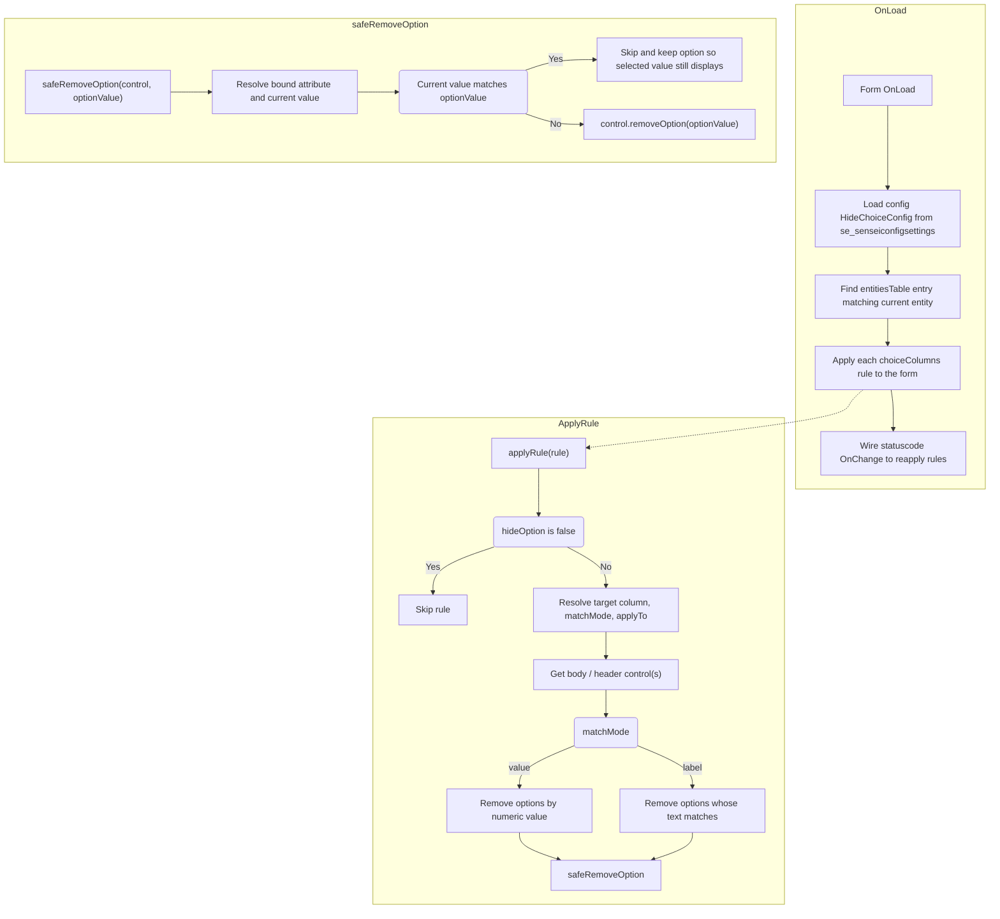

[[*TOC*]]

# Overview / Summary

**Hide Choice Options** is a client-side web resource (`Hide Choice Options.js`) that removes specific options from a Choice (Option Set) column on a Dynamics 365 form for both the main form control and the header control, without any hard-coded per-field logic. It is fully configuration-driven: at form load it reads the **Hide Choice Config** config setting (`HideChoiceConfig`), finds the rules that apply to the current entity, and removes the configured options from the matching column control(s).

Because the rules live in configuration, hiding an additional option or a whole new column requires only a config change, with no edit to this web resource and no per-column form-designer changes.

# Backlog Item/s

- #31158
- #33792

# Related Item/s

- [Hide Choice Fields - Overview](https://dev.azure.com/SenseiCloud/SA%20Water/_wiki/wikis/SA-Water.wiki/13437/Hide-Choice-Fields) 
- [Change Requests - Overview](https://dev.azure.com/SenseiCloud/SA%20Water/_wiki/wikis/SA-Water.wiki/12210/Change-Requests)

# Links

N/A

# Navigating to the Changes

Web Resource: Navigate to Power Apps ➡️ Solutions ➡️ **Sensei Base** ➡️ Web Resources ➡️ **Hide Choice Options.js**

Form Registration: Navigate to Power Apps ➡️ Solutions ➡️ **Sensei Base** ➡️ Tables ➡️ **Change Request** ➡️ Forms ➡️ **Main - Altus** ➡️ Events

Config Setting: Navigate to Power Apps ➡️ Tables ➡️ **Sensei Config Settings** (`se_senseiconfigsettings`) ➡️ **Hide Choice Config**

# Mermaid Diagram

# Changes Implemented

## Web Resource

| Property | Value |
| --- | --- |
| **Display Name / File** | Hide Choice Options.js |
| **Module** | `Altus.HideChoice` |
| **Type** | Script (JScript) |

The web resource also exposes `Altus.HideChoice.OnLoad`, `Altus.HideChoice.HideChoice` as aliases for the same entry point, kept for backwards compatibility, and `Altus.HideChoice.setConfigSettingName(name)`, which overrides the config setting name to read, defaulting to `HideChoiceConfig`.

## Form Registration

| Entity | Form | Event | Handler | Pass execution context |
| --- | --- | --- | --- | --- |
| Change Request | Main - Altus | OnLoad | `Altus.HideChoice` (or `Altus.HideChoice.OnLoad`) | Yes |

No `OnChange` registration is required in the form designer. The library wires its own `OnChange` handler on `statuscode` in code during `OnLoad`, so hidden options are re-applied whenever the record's status changes.

## How It Works

**Configuration source.** On load, the web resource reads the `HideChoiceConfig` setting from `se_senseiconfigsettings` (filtering on `se_logicalname`, selecting `se_value`), parses the JSON, and looks up the `entitiesTable` entry whose `entity` matches the current table's logical name. If no config, no entry for the entity, or no `choiceColumns` rules are found, the script exits without changing the form.

**Rule resolution.** For each rule under `choiceColumns`:

- **Target column**: `targetAttributeColumn.value`, falling back to `targetControl`, then to `statuscode`.
- **Match mode** (`matchMode`): `value` (default) matches options by their numeric option set value; `label` matches by the option's displayed text (case-insensitive).
- **Apply to** (`applyTo`): `body` targets only the main-form control, `header` targets only the header control, and anything else (including omitted) targets both.
- **Target values** (`targetValues`): the list of option values or labels to remove; accepts plain strings or numbers, or objects with a `choiceOptions` property, and blank entries are ignored.
- A rule with `hideOption: false` is skipped entirely.

**Removing options.** For each resolved control, matching options are removed via `control.removeOption(...)`. Before removing, the script resolves the control's bound attribute (via `getAttribute()`, or by deriving the attribute name from the control name as a fallback) and checks the field's **current value**. If the current value matches the option being targeted, that option is not removed, so a record that already has a "hidden" option selected continues to display it correctly.

**Header controls.** The header control is looked up first by its conventional name (`header_<column>`). If not found, the script falls back to scanning all form controls for one whose name starts with `header_` and whose bound attribute matches the target column.

**Reapplying on status change.** After the initial load, the script adds an `OnChange` handler to `statuscode` that re-runs the full config-driven apply via `setTimeout(0)`, so option visibility stays correct as the record's status changes.

**Resilience.** Errors reading or parsing the config, or manipulating an individual control, are caught and logged to the console (prefixed `[HideChoice]`) rather than breaking form load or blocking other rules from applying.

# PBI Traceability and Update Notes

| PBI | Last Updated | Last Updated By | Comments |
| --- | --- | --- | --- |
| #31158, #33792 | 16/September/2025 | E Avery | Initial documentation of the Hide Choice Options web resource |
