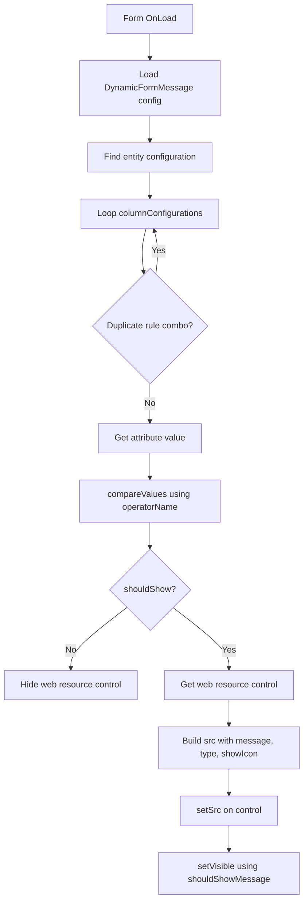

[[*TOC*]]

# Overview / Summary

**Dynamic Message** is a client-side web resource that displays a configurable message on a Dynamics 365 form. The web resource is shown or hidden when a configured column meets a configured condition, allowing form guidance to be changed through configuration rather than hard-coded form logic.

The web resource receives the message text, message type, and icon visibility through query-string parameters. Its visibility is controlled by the `DynamicFormMessage` Sensei Config Setting.

# Backlog Item/s

- #31518.

# Related Item/s

# Links

- [Dynamic Form Message - Repos](https://dev.azure.com/SenseiCloud/_git/SA%20Water?path=/Sensei%20Config%20Settings/Dynamic%20Form%20Message)
- [Dynamic Form Message - Overview](https://dev.azure.com/SenseiCloud/SA%20Water/_wiki/wikis/SA-Water.wiki/13439/Dynamic-Form-Message)

# Navigating to the Changes

Web Resource: Navigate to Power Apps -> Solutions -> **Sensei Base** -> Web Resources -> **Dynamic Message**.

Config Setting: Navigate to Power Apps -> Tables -> **Sensei Config Settings** (`se_senseiconfigsettings`) -> **DynamicFormMessage**.

Form Registration: Navigate to Power Apps -> Solutions -> **Sensei Base** -> the configured table -> Forms -> **Risk Form**

# Mermaid Diagram

# Changes Implemented

## Web resource

The web resource evaluates configuration for the current form entity and processes each configured column rule. When a rule matches, it updates the configured web resource source with the message parameters and sets the control visibility according to `shouldShowMessage`.

The web resource supports the following message parameters:

| Parameter | Description |
| --- | --- |
| `message` | The custom message text to display. |
| `type` | The message presentation type, defaulting to `info` when omitted. |
| `showIcon` | Whether the message icon should be displayed, defaulting to `true` when omitted. |

The URL also includes a timestamp parameter so that the updated message source is loaded after a rule is re-evaluated.

## Form event behaviour

The registered handler receives the form execution context and obtains the current form entity logical name. It then loads the `DynamicFormMessage` setting and applies the matching entity and column configurations.

The handler does not change controls when:

- The setting is missing or cannot be parsed.
- The configuration does not contain `entityConfigurations`.
- No configuration exists for the current entity.
- A configured column or web resource control cannot be found.
- The configured comparison does not match the current value.

When a comparison does not match, the configured web resource control is hidden. When it matches, the control source is updated and its visibility is set from `shouldShowMessage`.

## How it works

**Entry point.** `Altus.setVisibilityCustomMessage` is called on form `OnLoad`. It resolves the current entity's logical name, loads the `DynamicFormMessage` setting via `SenseiToolkit.loadAltusConfigSetting`, and parses the returned value as JSON if it was returned as a string.

**Entity and column lookup.** The handler finds the `entityConfigurations` entry whose `entityLogicalName` (a plain string or an object with a `value` property) matches the current entity. If none is found, or the entity has no `columnConfigurations`, the script exits without changing the form.

**Duplicate rule handling.** Before processing, each `columnConfigurations` entry is reduced to a key made up of its logical name, operator, column value, web resource name, and `shouldShowMessage` flag. Rules that produce a key already seen are skipped, so identical rules configured more than once are only evaluated once.

**Column evaluation (`Altus.processColumnConfiguration`).** For each remaining rule, the script resolves the target attribute (`logicalName`, again as a string or `value` object) and reads its current value with `Altus.getAttributeValue`. It then calls `Altus.compareValues` to evaluate the rule's `operatorName` against `columnValue`.

**Type-aware comparison (`Altus.compareValues`).** The raw attribute value is compared first. If that comparison does not match and the attribute is a lookup, the script retries using the lookup's display name, then its normalised GUID (case-insensitive, braces stripped) via `Altus.normalizeGuid`. Boolean attributes are retried as `"Yes"`/`"No"` text, and Choice (option set) attributes are retried using their displayed text via `attribute.getText()`.

**Operator evaluation (`Altus.evaluateComparison`).** Supported operators include equality/inequality, numeric/date comparisons (`>`, `<`, `>=`, `<=`), data-presence checks (`contains data`, `does not contain data`), string checks (`starts with`, `ends with`, `contains`, and their negations), and date checks (`is in past`, `is in future`) evaluated against the current date and time. An unrecognised operator logs an error and evaluates to no match.

**Applying the result.** If the comparison does not match, the configured web resource control is hidden via `setVisible(false)`. If it matches, the script strips any existing query string from the control's current source, rebuilds it with the `message`, `type`, `showIcon`, and a cache-busting timestamp (`t`) parameter, calls `setSrc` with the new URL, and sets the control's visibility from `shouldShowMessage`.

**Reading the configuration setting (`SenseiToolkit`).** `loadAltusConfigSetting` queries the `se_senseiconfigsettingses` Dataverse Web API endpoint, filtering `se_logicalname` for the requested setting name and selecting `se_value`. If a matching record is found, its `se_value` is parsed as JSON where possible, otherwise the raw string is returned. `searchDataverse` performs the underlying Web API `fetch` call and throws if the response is not successful.

**Resilience.** Errors thrown while loading or parsing the configuration, or while processing an individual column configuration, are caught and logged to the console rather than breaking form load or preventing other rules from being evaluated.

## Supported comparisons

The web resource supports the following operators:

| Operator | Behaviour |
| --- | --- |
| `=` | Matched when the values are equal. |
| `<>` | Matched when the values are different. |
| `>`, `<`, `>=`, `<=` | Matched using the corresponding comparison. |
| `contains data` | Matched when the column contains a non-empty value. |
| `does not contain data` | Matched when the column is empty or null. |
| `starts with`, `does not start with` | Matched against the beginning of the value. |
| `ends with`, `does not end with` | Matched against the end of the value. |
| `contains` | Matched when the value contains the configured text. |
| `is in past`, `is in future` | Matched by comparing the column date with the current date and time. |

Lookup columns can be compared using the lookup name or identifier. Boolean columns can be compared using `Yes` or `No`, and Choice columns can be compared using their displayed text.

## Reporting

A before-and-after visual comparison is not applicable because this change is a configuration-driven form web resource. The message content and visibility vary according to the configured entity, column, operator, and value.

# PBI Traceability and Update Notes

| PBI | Last Updated | Last Updated By | Comments |
| --- | --- | --- | --- |
| #31518 | 16/September/2026 | E Avery | Initial documentation of the Dynamic Message web resource. |
